<p align="center">
  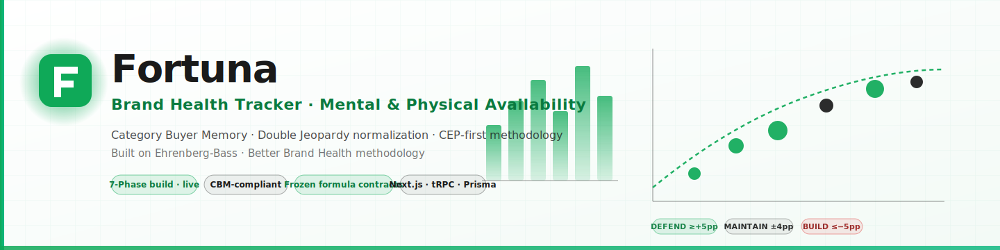
</p>

<p align="center">
  <b>Measure brand health the way Ehrenberg-Bass actually meant it.</b><br/>
  Category Buyer Memory · Mental & Physical Availability · Double Jeopardy normalization<br/>
  Made by <a href="https://github.com/matiyashu">Prima Hanura Akbar</a>
</p>

<p align="center">
  
  
  
  
  
  
  
</p>

---

## What is this?

**Fortuna** is a **Category Buyer Memory (CBM)** brand health tracker. You upload survey waves, and it measures how strongly your brand is linked to **Category Entry Points (CEPs)** — the buying occasions inside category buyers' heads — and translates that into mental advantage, physical availability gaps, and forecasted share movement.

It does this with the discipline Ehrenberg-Bass actually requires: **binary pick-any** survey data, **alphabetical brand ordering**, a **non-buyers + light** default segment, and every score **DJ-normalized** so a small brand isn't unfairly compared to a large one. The whole workbench — CEP builder, survey distribution, mental advantage map, physical availability audit, WOM tracker, marketing reach, forecast engine, reports — ships in one dashboard.

**Why it matters.** Most "brand trackers" measure awareness and likeability — metrics that correlate weakly with sales. Fortuna measures **mental penetration**, **mental market share**, and **MMS → SMS** gap — the metrics that actually predict where share moves next quarter. The deviation between *expected* and *actual* CEP linkage is exactly where the next campaign brief should go.

> 💡 **The methodology is built in, not pasted on.** Formula contracts for MPen, MMS, NS, SoM, and DJ Expected Score live frozen in `/lib/cbm-engine/formula-contracts/` and are protected by CI guards. A PR that changes them needs an explicit methodology-review label.

---

## Quick start

### Try the demo (no install required)

Fortuna ships with a fully-populated demo mode that needs no database, no auth, no API keys. Every chart and table renders against realistic sample data so you can walk every page end-to-end.

```bash
git clone https://github.com/matiyashu/Brand-Health-Tracker---Mental-Availability-Physical-Availability.git
cd Brand-Health-Tracker---Mental-Availability-Physical-Availability
npm install
npm run dev
# open http://localhost:3000 → click "Open Dashboard"
```

That's it. Landing page renders, segment toggle works, every dashboard page renders with sample data, the CEP builder accepts new entries, the survey builder lets you compose waves, and the reports endpoint generates a real PPTX/PDF you can download.

### Run the full pipeline

To run against real survey data with DJ normalization computed in Python and persistence in Postgres, all three halves run together:

```bash
# 1) Database (optional but recommended)
cp .env.example .env.local
# fill DATABASE_URL with a Postgres connection string
npx prisma migrate dev --name init
npx prisma generate

# 2) Python analytics service (MPen, MMS, NS, SoM, DJ normalization)
cd analytics-service
pip install -r requirements.txt
uvicorn main:app --reload --port 8000

# 3) Next.js app (in a second terminal, from repo root)
npm run dev          # http://localhost:3000
```

Now visit `/dashboard`, upload an Excel/CSV via the data-entry modal, and watch the Python service compute KPIs and write them back to Postgres for the dashboard to render.

---

## Screenshots

Real captures of the running dashboard in demo mode.

<table>
  <tr>
    <td width="50%">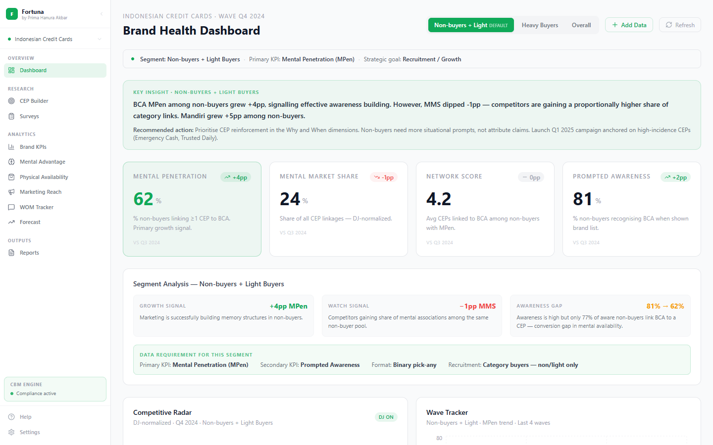</td>
    <td width="50%">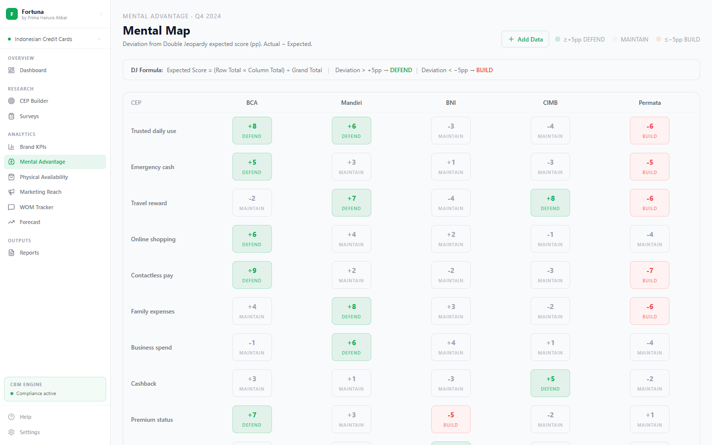</td>
  </tr>
  <tr>
    <td align="center"><b>Dashboard</b><br/><sub>Segment-aware KPI cards, radar chart, wave tracker, MMS vs SMS gap diagnosis</sub></td>
    <td align="center"><b>Mental Advantage Map</b><br/><sub>Brand × CEP heatmap with DJ-normalized DEFEND / MAINTAIN / BUILD bands</sub></td>
  </tr>
  <tr>
    <td width="50%">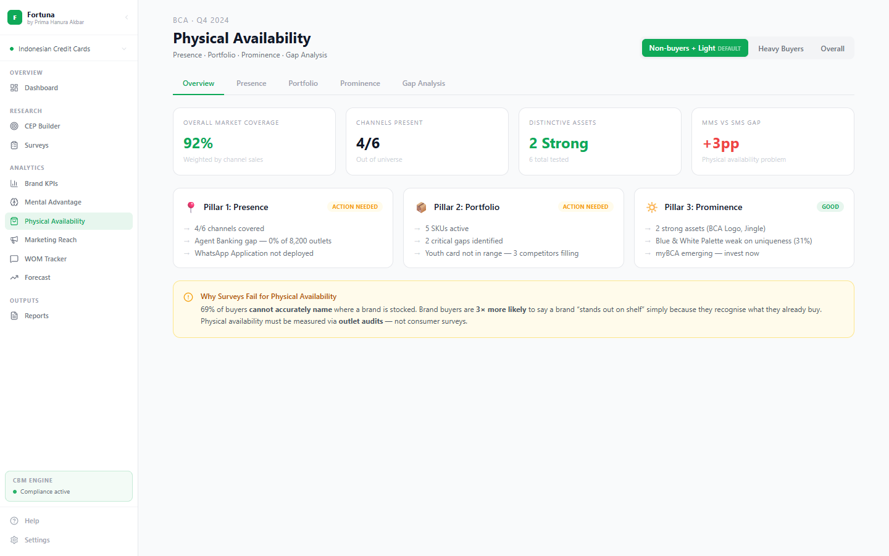</td>
    <td width="50%">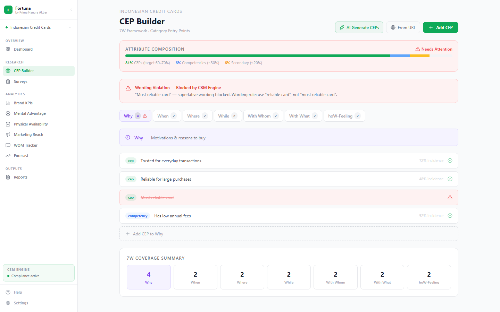</td>
  </tr>
  <tr>
    <td align="center"><b>Physical Availability</b><br/><sub>Three-pillar audit: presence, portfolio, prominence with distinctive asset matrix</sub></td>
    <td align="center"><b>CEP Builder</b><br/><sub>7W framework, composition meter, wording linter, AI generate / critique</sub></td>
  </tr>
  <tr>
    <td width="50%">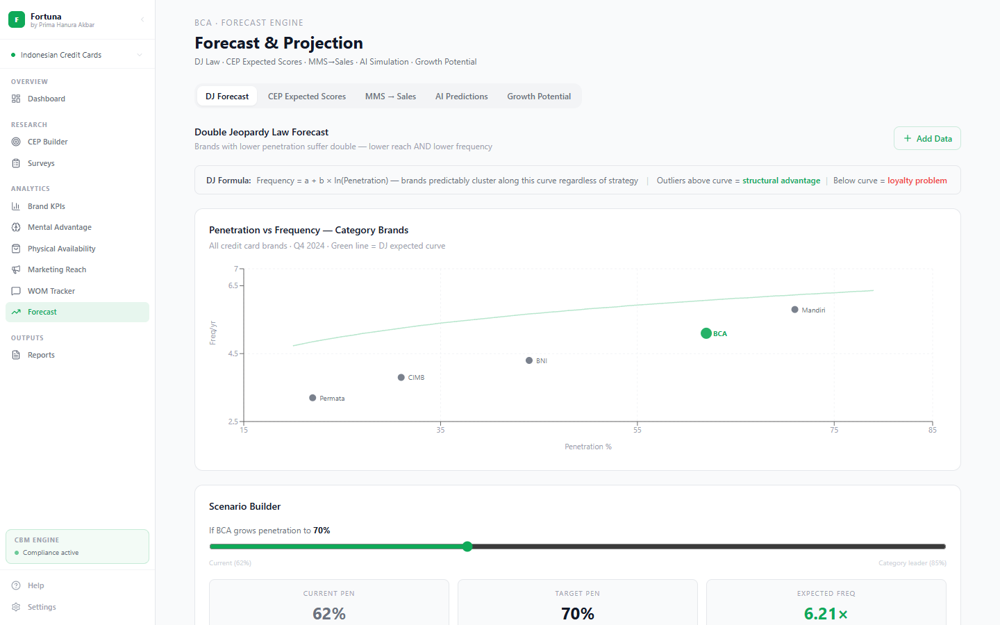</td>
    <td width="50%">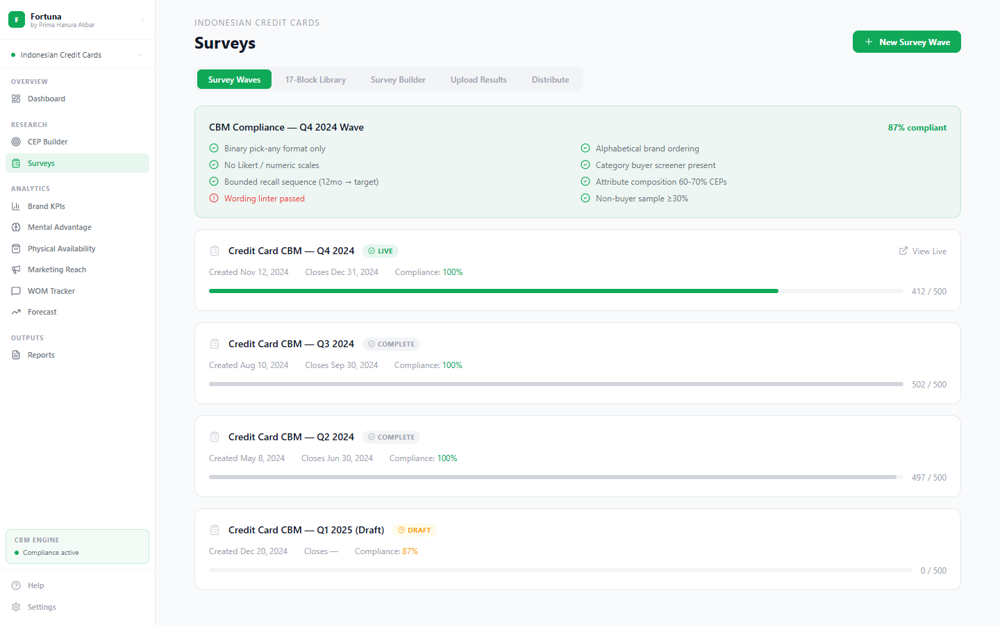</td>
  </tr>
  <tr>
    <td align="center"><b>Forecast Engine</b><br/><sub>5 tabs: DJ Forecast, CEP Expected Scores, MMS→Sales, AI Predictions, Growth Potential</sub></td>
    <td align="center"><b>Survey Builder</b><br/><sub>17-block CBM-locked library, drag-drop canvas, distribution to email & WhatsApp</sub></td>
  </tr>
  <tr>
    <td width="50%">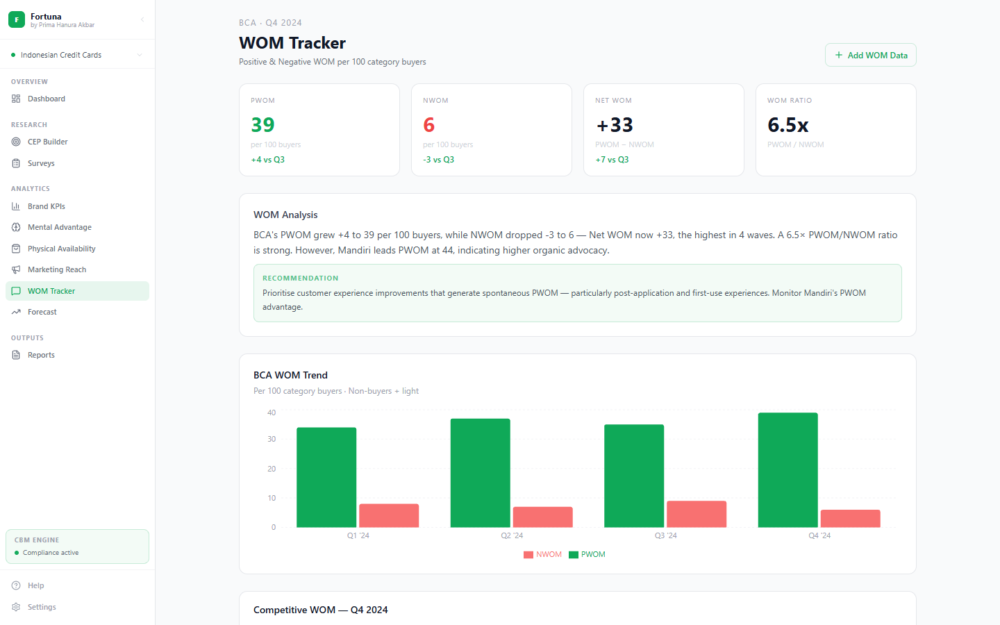</td>
    <td width="50%">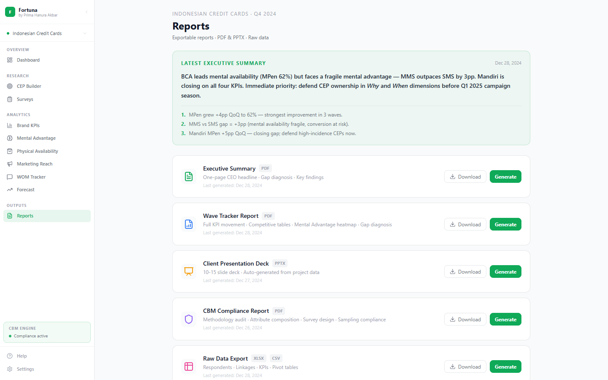</td>
  </tr>
  <tr>
    <td align="center"><b>WOM Tracker</b><br/><sub>PWOM / NWOM per 100 category buyers (binary, not NPS), competitive wave trend</sub></td>
    <td align="center"><b>Reports</b><br/><sub>One-click PPTX (6 slides) and PDF (executive summary + full KPI table) export</sub></td>
  </tr>
</table>

> See more: <a href="screenshots/landing.png">landing</a> · <a href="screenshots/analytics.png">analytics</a> · <a href="screenshots/reach.png">reach</a> · <a href="screenshots/projects.png">projects</a> · <a href="screenshots/settings.png">settings</a> · <a href="screenshots/help.png">help</a>

---

## How it works

Fortuna is a five-phase pipeline that mirrors how a CBM-disciplined brand team would actually build a tracker:

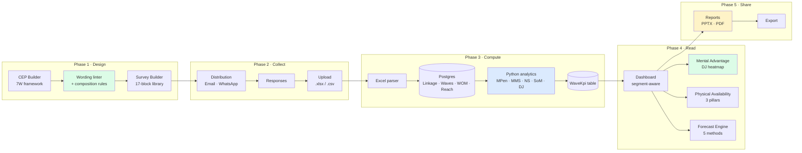

The key architectural decision: **methodology before UX**. The formula contracts, the CBM mantra validators, the attribute-rule linter, and the survey guards all ship *before* the dashboard. You can't compose a survey that breaks binary-pick-any. You can't add a CEP whose wording contains a superlative. You can't change MMS without a methodology review. The discipline comes first; the UX serves it.

### The core formulas (frozen contracts)

These live in [`lib/cbm-engine/formula-contracts/`](lib/cbm-engine/formula-contracts/) and are protected by a CI guard that fails any PR touching them without an explicit `methodology-review-approved` label.

```
MPen  =  (Buyers linking ≥1 CEP to brand) ÷ Total sample × 100
MMS   =  (Brand's total CEP links) ÷ (Total CEP links across all brands) × 100
NS    =  (Total CEP links for brand) ÷ (Buyers with MPen for that brand)
SoM   =  MMS weighted by CEP quality

Expected(brand, CEP) = (Row Total × Column Total) ÷ Grand Total
Deviation             = Actual − Expected
DEFEND ≥ +5pp | MAINTAIN ±4pp | BUILD ≤ −5pp
```

Once you have `(MPen, MMS, NS, SoM)` per brand per wave, those are the *building blocks* that every downstream view — mental advantage, physical gap diagnosis, forecast — composes from. Changing them changes everything; that's why they're frozen.

### Methodology guardrails

Six rules decide whether a Fortuna survey is CBM-compliant — and each is enforced *in code*, not in a guide:

1. **Binary pick-any only.** No Likert, no sliders, no numeric scales. The survey builder won't let you add them; the upload parser rejects them.
2. **Alphabetical brand ordering.** Position bias is the #1 cause of inflated scores for the first brand listed. The survey renderer alphabetises every list and the upload parser checks order.
3. **No modified attribute wording.** Words like *most*, *best*, *more*, *least*, *first*, *only* are blocked by the attribute-rule linter at CEP-create time.
4. **Non-buyer + light is the default segment.** The growth pool. Heavy buyers already prefer you and inflate every KPI. The dashboard defaults to `NON_LIGHT`; switching to `HEAVY` or `OVERALL` is explicit.
5. **DJ normalization, always.** Every score on the mental advantage map shows deviation from `Expected = (Row × Col) ÷ Grand`. Small brands aren't compared raw against large ones.
6. **Composition target: 60–70% CEPs.** The CEP builder shows a live composition meter; baseline competencies are capped at 30%, secondary attributes at 20%.

A survey that fails any rule is hard-blocked from launch — the distribution endpoint refuses to send it. Every CBM-compliant survey carries a checklist in the launch modal showing each rule and which row of state it derives from.

---

## The dashboard, page by page

The frontend is organized into the workbench under `/dashboard`. Sidebar groups by *what the data tells you*:

### Overview & Analytics
- **`/dashboard`** — segment-aware command centre. Toggle between **Non-buyers + Light** (default), **Heavy Buyers**, and **Overall**. KPI cards, radar chart, wave tracker, CEO-ready insight strap.
- **`/dashboard/analytics`** — competitive benchmarking across all brands. DJ-normalized bar charts, segment-aware ranking table, data requirements checklist.

### Mental Availability
- **`/dashboard/mental-advantage`** — brand × CEP heatmap. DJ-expected score per cell; DEFEND (+5pp) / MAINTAIN (±4pp) / BUILD (−5pp) bands surface mental assets and mental gaps.
- **`/dashboard/ceps`** — CEP Builder. 7W framework tabs (Who, What, When, Where, Why, With What, With Whom). Live composition meter enforces 60–70% CEPs; wording linter flags superlatives, brand-specific phrasing, duplicate entries. AI generator powered by Anthropic Claude with **generate** and **critique** modes.

### Physical Availability
- **`/dashboard/physical`** — three-pillar audit: **Presence** (channel coverage vs category norm), **Portfolio** (SKU contribution, penetration efficiency), **Prominence** (Fame × Uniqueness matrix for distinctive assets, rented-prominence tracker). Includes per-segment MMS vs SMS gap diagnosis.
- **`/dashboard/reach`** — Effective Reach (de-branded stimulus), Correct Branding %, Branding Ratio (below 60% flags *vampire creative*).
- **`/dashboard/wom`** — PWOM / NWOM per 100 category buyers in *binary format, not NPS*. Net WOM and WOM Ratio with competitive wave-on-wave trend.

### Forecast & Action
- **`/dashboard/forecast`** — five-method forecast engine. **DJ Forecast** (scatter + scenario builder), **CEP Expected Scores** (full brand × CEP matrix), **MMS → Sales** (r=0.83, 1–2 quarter lag), **AI Predictions** (media spend simulator, category twin benchmarks), **Growth Potential** (non-buyer MPen waterfall).
- **`/dashboard/surveys`** — survey workbench. Four tabs: **Waves** (timeline + status), **17-Block Library** (CBM-locked questions), **Builder** (drag-drop canvas), **Upload Results** (Excel/CSV with AI analysis).
- **`/dashboard/reports`** — exportable reports. PPTX (6-slide deck) and PDF (executive summary + full KPI table). Both pull live data, both fall back to demo data automatically.

### Multi-project & Help
- **`/projects`** — multi-project workspace with active/draft/archived states.
- **`/projects/generate`** — AI Project Generator. Mode A (business info form), Mode B (URL → Cheerio + Playwright scrape) → auto-generated category, CEPs, brand list, survey wave.
- **`/dashboard/help`** — full in-app product manual: CBM basics, methodology guide, KPI reference, dashboard tours, FAQ.
- **`/dashboard/settings`** — Appearance (6 themes + custom picker, light/dark/system), Layout (density, font, sidebar), Regional (EN/ID, currency, date, timezone), Data & Privacy.

---

## Build status — Phases 0–6 complete

The build plan ships in 7 phases. Phases 0–6 are live; Phase 7 (QA + production deploy) is next.

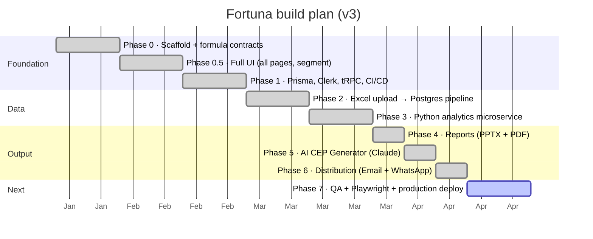

### What each phase shipped

| Phase | Theme | What changed |
|---|---|---|
| **0** | Scaffold | Next.js 14 App Router monorepo, Tailwind v3 + neon-green theme, folder structure, frozen formula contracts in `lib/cbm-engine/formula-contracts/` (MPen, MMS, NS, SoM, Mental Advantage). |
| **0.5** | Full UI | Every dashboard page rendered with sample data: dashboard, analytics, mental advantage, physical, reach, WOM, forecast (5 tabs), CEPs, surveys (4 tabs), reports, help, settings. Segment toggle wired globally via React Context. |
| **1** | Foundation | Prisma v5 schema (Project, Wave, Brand, CEP, Linkage, WaveKpi, WomData, ReachData, ChannelPresence). tRPC v10 router tree. Clerk v4 auth (optional). GitHub Actions CI: lint + build + pytest + formula-contract guard. |
| **2** | Live data | Excel/CSV upload endpoint (`/api/upload`). `lib/excel/parser.ts` handles 5 data types. Postgres write path through tRPC. Dashboard refreshes via tRPC subscription on wave change. |
| **3** | Analytics | `analytics-service/` FastAPI microservice. Computes MPen, MMS, NS, SoM, DJ normalization. Eight pytest cases. Called from Next.js via `/api/analytics` proxy with `ANALYTICS_SERVICE_URL`. |
| **4** | Reports | `/api/reports` endpoint. PPTX via `pptxgenjs` (6 slides: Cover, KPI Scorecard, Mental Advantage Map, WOM, Reach, Methodology). PDF via Puppeteer (executive summary + full KPI table). Both fall back to demo data. |
| **5** | AI | `/api/ai/cep-generator` powered by Anthropic Claude (`claude-opus-4-6`). Two modes: **generate** (produces a CBM-compliant CEP portfolio for a category) and **critique** (audits existing CEPs for violations). Works in demo mode without API key. |
| **6** | Distribution | `/api/distribution/email` (Resend primary, SMTP fallback). `/api/distribution/whatsapp` (Meta Cloud API v19.0). CSV recipient import, channel selector, batch sending, delivery receipts via webhook, branded email template. |

**Methodology contract — what's enforced in CI:**
- The formula-contract guard refuses any PR that touches `lib/cbm-engine/formula-contracts/` without a methodology-review-approved label.
- The attribute-rule linter blocks any CEP wording containing a superlative.
- The survey-guard checklist runs in pre-flight before any distribution send.
- The segment default is locked to `NON_LIGHT` at provider level; switching is explicit user interaction.
- Python tests assert MPen, MMS, DJ Expected Score against hand-verified fixtures.

### Up next — Phase 7

- Playwright e2e tests covering every dashboard route + happy-path survey flow.
- Lighthouse / CWV audit on `/dashboard` and `/dashboard/mental-advantage`.
- Production Vercel + Render deploy with environment-promoted Postgres.
- Sentry + rate-limiting on `/api/distribution/*` and `/api/reports`.

---

## Architecture

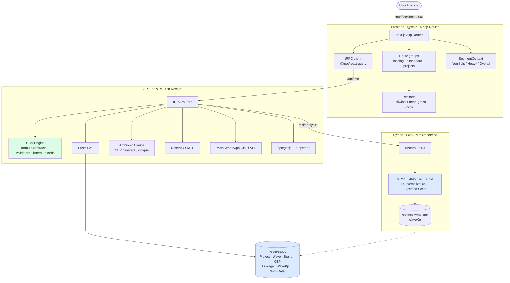

### Layers

- **Frozen CBM Engine** ([`lib/cbm-engine/`](lib/cbm-engine/)) — pure functions for MPen, MMS, NS, SoM, DJ Expected Score; CBM mantra validators; attribute-rule linter (wording + composition); survey guards (binary, alphabetical, non-buyer quota). CI-protected.
- **tRPC routers** ([`lib/trpc/routers/`](lib/trpc/routers/)) — `projects`, `waves`, `brands`, `ceps`, `linkage`, `analytics`, `distribution`. Type-safe end-to-end with @tanstack/react-query.
- **Prisma data layer** ([`prisma/schema.prisma`](prisma/schema.prisma)) — relational schema with Project as top-level tenant; Waves contain WaveKpi (computed), Linkage (raw), WomData, ReachData, ChannelPresence.
- **Excel parser** ([`lib/excel/parser.ts`](lib/excel/parser.ts)) — five data types (linkage, WOM, reach, presence, brand list). Schema-validated with Zod.
- **Python analytics microservice** ([`analytics-service/`](analytics-service/)) — FastAPI app computing MPen, MMS, NS, SoM, DJ normalization. Eight pytest cases against hand-verified fixtures.
- **Reports** ([`lib/reports/pptx.ts`](lib/reports/pptx.ts), Puppeteer PDF) — server-side generation, demo-data fallback, branded template.
- **Distribution** (`/api/distribution/*`) — Resend (primary email), nodemailer SMTP (fallback), Meta WhatsApp Cloud API v19.0 with approved-template enforcement.

---

## Tech stack

**Frontend**
- Next.js 14 App Router · TypeScript · Tailwind CSS v3
- Recharts (Bar, Line, Scatter, Pie, Radar) · lucide-react (icons)
- React Context for segment state · @tanstack/react-query v4 via tRPC

**API**
- tRPC v10 (type-safe end-to-end) · Zod schemas
- Prisma v5 ORM
- Clerk v4 auth (optional — demo mode without keys)

**Analytics**
- Python 3.11 · FastAPI · pandas · numpy
- pytest (8 cases on MPen / MMS / DJ Expected Score fixtures)

**AI & integrations**
- Anthropic Claude (`claude-opus-4-6`) — CEP generate + critique
- Resend (primary) + nodemailer SMTP (fallback) — survey email
- Meta WhatsApp Business Cloud API v19.0 — Indonesian market distribution
- Cheerio + Playwright — URL scraping for AI Project Generator

**Reports & data**
- pptxgenjs (6-slide branded PPTX) · Puppeteer (PDF)
- xlsx package (Excel/CSV ingestion, 5 data types)

**Infrastructure**
- PostgreSQL 15 via Prisma
- GitHub Actions CI: lint + Next.js build + Python pytest + **formula-contract guard**
- *Planned (Phase 7)*: Playwright e2e, Sentry, rate limiting
- Vercel (frontend) · Render or Fly.io (backend + analytics)

---

## Roadmap

The build plan + AI/distribution layer are functionally complete. The remaining work is production hardening.

| Stage | Status | What it does |
|---|---|---|
| Phase 0–6 (scaffold → distribution) | ✅ Complete | Full UI, Prisma + tRPC, Python analytics, Excel pipeline, reports, AI CEP, email + WhatsApp distribution |
| **Phase 7 — QA + Deploy** | 🔜 **Up next** | Playwright e2e covering all 14 dashboard routes; Lighthouse audit; Vercel + Render deploy; Sentry; rate limiting on distribution + reports |
| Custom Dashboard Builder | Planned | react-grid-layout with 12 draggable widgets, save/share/export per project (v3 Phase 7 — deferred) |
| Multi-tenant production | Planned | Clerk Organizations, per-org RLS in Postgres, audit log surface |
| Forecast v2 (live MMS→SMS) | Planned | Live SMS feed from client BI, automated trend alerts, AI commentary on deviation |

---

## Repository layout

```
brandhealth/
├── .github/workflows/
│   └── ci.yml                          lint · build · pytest · formula-contract guard
├── app/
│   ├── page.tsx                        landing
│   ├── layout.tsx · globals.css        root layout + neon-green theme
│   ├── api/
│   │   ├── trpc/[trpc]/route.ts        tRPC HTTP handler
│   │   ├── upload/route.ts             Excel/CSV ingestion
│   │   ├── analytics/route.ts          proxy → Python service
│   │   ├── reports/route.ts            PPTX / PDF download
│   │   ├── ai/cep-generator/route.ts   Anthropic Claude generate + critique
│   │   └── distribution/
│   │       ├── email/route.ts          Resend / SMTP send
│   │       ├── whatsapp/route.ts       Meta Cloud API send
│   │       └── webhook/route.ts        delivery receipts
│   ├── dashboard/
│   │   ├── layout.tsx                  SegmentProvider wrapper
│   │   ├── page.tsx                    overview (segment-aware)
│   │   ├── analytics/                  competitive KPIs
│   │   ├── mental-advantage/           DJ heatmap
│   │   ├── physical/                   3-pillar availability audit
│   │   ├── reach/                      effective reach + correct branding
│   │   ├── wom/                        PWOM / NWOM tracker
│   │   ├── forecast/                   5-tab forecast engine
│   │   ├── ceps/                       CEP Builder + AI
│   │   ├── surveys/                    builder + library + upload + distribute
│   │   ├── reports/                    PPTX / PDF export
│   │   ├── help/                       in-app manual
│   │   └── settings/                   theme · layout · regional · privacy
│   ├── projects/
│   │   ├── page.tsx                    multi-project switcher
│   │   └── generate/page.tsx           AI Project Generator (URL or business info)
│   └── sign-in · sign-up               Clerk routes
├── analytics-service/
│   ├── main.py                         FastAPI · MPen · MMS · DJ normalization
│   ├── requirements.txt
│   └── tests/test_calculations.py      8 pytest cases
├── components/                         sidebar, segment-toggle, kpi-card, wave-chart, ...
├── contexts/segment-context.tsx        global segment state (NON_LIGHT default)
├── lib/
│   ├── cbm-engine/
│   │   ├── formula-contracts/          FROZEN — mpen.ts, mms.ts, ns.ts, som.ts, mental-advantage.ts
│   │   ├── mantra-validators/          CBM compliance checks
│   │   ├── attribute-rules/            wording linter + composition validator
│   │   └── survey-guards/              pre-launch survey compliance
│   ├── excel/parser.ts                 5 data type Excel/CSV parser
│   ├── reports/pptx.ts                 6-slide PPTX builder
│   ├── trpc/init.ts                    tRPC context
│   └── trpc/routers/                   projects · waves · brands · ceps · linkage · analytics · distribution
├── prisma/schema.prisma                Project · Wave · Brand · CEP · Linkage · WaveKpi · WomData
├── screenshots/                        14 captures of every dashboard route
├── assets/banner.svg                   README banner
├── middleware.ts                       Clerk middleware (optional)
├── CLAUDE.md                           build-plan context for Claude Code
└── README.md                           you are here
```

---

## Deployment

### Frontend on Vercel (demo mode, no backend)

Simplest deploy — useful for sharing screenshots or any non-interactive showcase:

1. Fork the repo
2. Create a Vercel project, point it at the repo root
3. Set `NEXT_PUBLIC_DEMO_MODE=1` in Vercel env (no DB calls, no API calls, every page renders sample data)
4. Push to `main` — Vercel auto-deploys

### Full production (Vercel + Render)

For live data with DJ normalization and persistence:

1. **Postgres**: provision on Render / Neon / Supabase — get `DATABASE_URL`.
2. **Python analytics**: deploy `analytics-service/` to Render as a web service. Note its public URL.
3. **Vercel**: project root deploy with env vars:
   - `DATABASE_URL=postgres://...`
   - `ANALYTICS_SERVICE_URL=https://your-analytics.onrender.com`
   - `ANTHROPIC_API_KEY=...` (optional, for AI CEP)
   - `RESEND_API_KEY=...` + `EMAIL_FROM=...` (optional, for email distribution)
   - `WHATSAPP_PHONE_NUMBER_ID=...` + `WHATSAPP_ACCESS_TOKEN=...` (optional, for WhatsApp)
   - `NEXT_PUBLIC_CLERK_PUBLISHABLE_KEY=...` + `CLERK_SECRET_KEY=...` (optional, for auth)
4. Run `npx prisma migrate deploy` once against the production DB.

The app gracefully degrades — every env var is optional, every page falls back to demo data when the corresponding integration is absent.

---

## Environment variables

All keys are optional — the app runs in demo mode when they are absent.

```bash
# Database
DATABASE_URL=""                         # PostgreSQL connection string

# Auth (Clerk)
NEXT_PUBLIC_CLERK_PUBLISHABLE_KEY=""
CLERK_SECRET_KEY=""

# Analytics microservice
ANALYTICS_SERVICE_URL=http://localhost:8000

# AI (Anthropic Claude — CEP generator)
ANTHROPIC_API_KEY=""

# Email distribution
RESEND_API_KEY=""                       # Option A: Resend
EMAIL_FROM="survey@yourdomain.com"
SMTP_HOST=""                            # Option B: SMTP fallback
SMTP_PORT="587"
SMTP_USER=""
SMTP_PASS=""

# WhatsApp distribution (Meta Cloud API)
WHATSAPP_PHONE_NUMBER_ID=""
WHATSAPP_ACCESS_TOKEN=""
WHATSAPP_TEMPLATE_NAME="survey_invite"
WHATSAPP_WEBHOOK_VERIFY_TOKEN="fortuna-webhook-verify"

# App
NEXT_PUBLIC_APP_URL="http://localhost:3000"
```

---

## Contributing

This is a one-author research-and-build project at the moment. Issues and PRs are welcome but please open an issue first — the formulas in `lib/cbm-engine/formula-contracts/` are explicitly frozen and changes there go through extra review.

**Hard rules for any PR:**
1. Branch from `main`: `git checkout -b feature/your-feature`
2. **Never** modify `lib/cbm-engine/formula-contracts/` without a methodology-review-approved label.
3. `npm run build` must pass cleanly (ESLint + TypeScript).
4. Segment default must remain `NON_LIGHT` unless explicitly changed by user interaction.
5. All CEP wording must pass the attribute-rule linter (no superlatives).

---

## Credits & references

- **Methodology**: Ehrenberg-Bass Institute — *Better Brand Health* / *How Brands Grow* (Sharp, Romaniuk). Category Buyer Memory framework.
- **Built by**: [Prima Hanura Akbar](https://github.com/matiyashu) · Jakarta · 2026.
- **For**: Digital& (Jakarta-based performance marketing agency).
- **License**: MIT.

---

<p align="center">
  <sub>If this project is useful to you, ⭐ the repo. If you ship a campaign with it, I'd love to hear about it.</sub>
</p>
